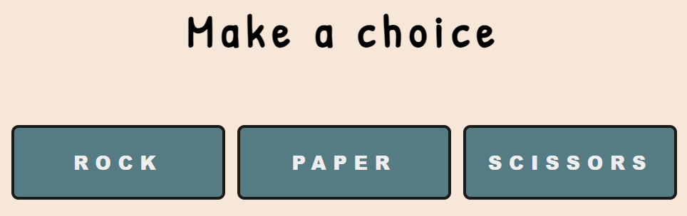
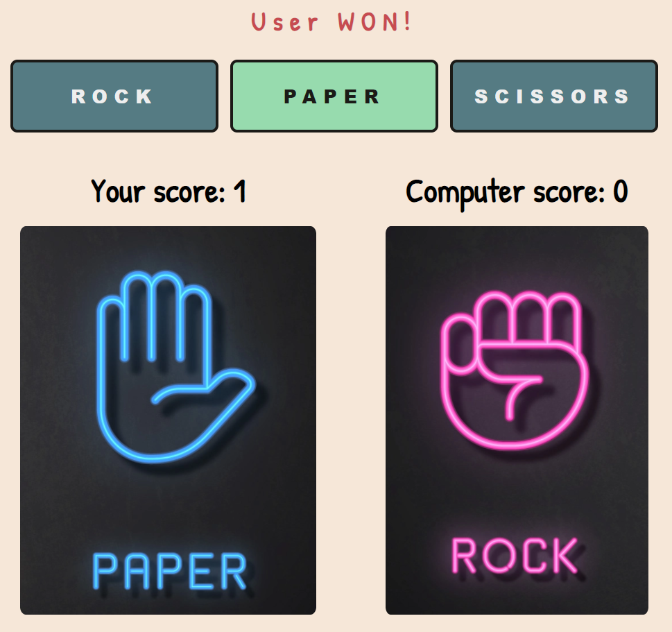
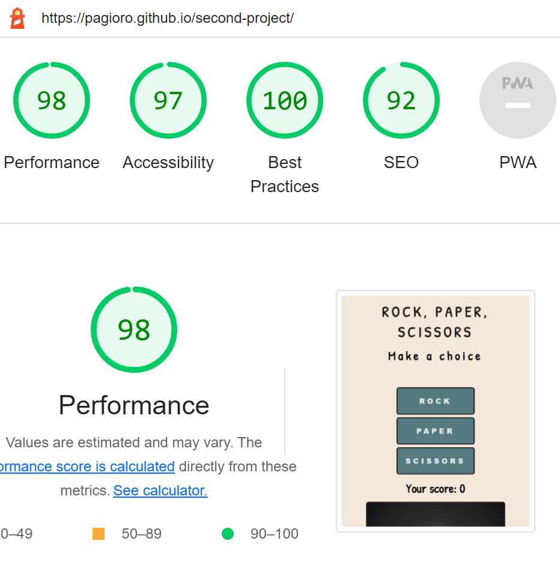
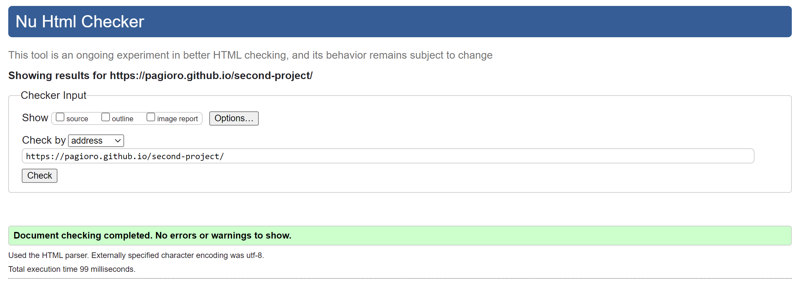
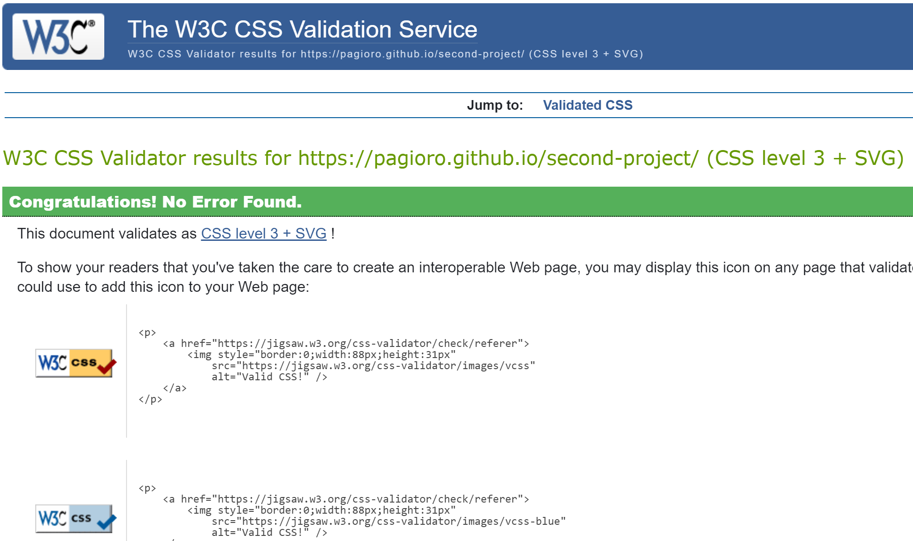

# Rock, Paper and Scissors Game

Rock, Paper, Scissors computer game is a two-player recreational hands-on game that doesn't require any materials nor a great deal or special skill.

It was made for both adults and children where you will choose one of the three buttons that will represent your mother and the computer will make a random choice of which hand it will use.

Fun and well-known game around the world

# Features

### Existing Features

    - Featured at the top of the page the header shows the game name and has a clearly contrast with the background. 

    - The header tells the user what game they are playing.

- __The Game Options__

    - The games options include clear instruction in the footer and the choice of buttons: Rock, Paper and Scissors. 

    - These options are interactive, and the user can click to make their choice.

- __Game results__

    - If the user chooses an option, the image will change to the one he chooses and randomly, the computer image will also change.

    - After the computer randomly chooses one, it will be determined the victory of one of the two.

    - The winner is announced to the user above the options button, and the score is updated for either the user or the computer, depending on who on.

    - The results ans score are clear to the user, making the game easy to play, understand who won and waht the score is.

  

  - __Footer__

     - The footer section show the rules to the user.

  

    # Testing

    - I tested the game in different browsers and they all work.   

    - I tested the game results and are always correct.

    - The header, instructions, options and footer text are all readable and easy to understand.

    - The colour and fonts are easy to read and accessible by running it through lighthouse in devtools.

    

    - This project is responsive, and works on all screens using devtools device toolbars.

    # Unfixed Bugs    

    - No unfixed bugs.

    # Fixed Bugs

    - The tie was not appearing and was resolved with the code let div = document.getElementById('messages') div.innerHTML = 'Tie!' in the game function

    - The images were not showing up, and I forgot to redirect the code to the correct folder.  

    ## Validator Testing

    - HTML
        - No errors were returned when passing through the official W3C validator

    

    - CSS
        - No errors were returned when passing through the official (Jigsaw) validator

    
       

    # Deployment

    - The site was deployed to GitHub pages. The steps to deploy are as follows:

    - In the GitHub repository, navigate to the Settings tab In the pages section, go to select branch drop-down menu, select Main Once the Main branch has been selected, a link to the site is provided

    - The live link can be found here - https://pagioro.github.io/first-project/

    # Credits

    ### content

    - When making my project, I was inspired by the Code Institute love running project and Coders Coffeehouse.

    - Font was sourced from Google Fonts https://fonts.google.com/

    - Icons were sourced from Font Awesome https://fontawesome.com/

    - I used cloudconvert and ezgif to minimize the image file sizes https://cloudconvert.com/jpg-to-webp and https://ezgif.com/optiwebp

    ### media

    - All pictures were taken from the open source site Pexels https://www.pexels.com/
